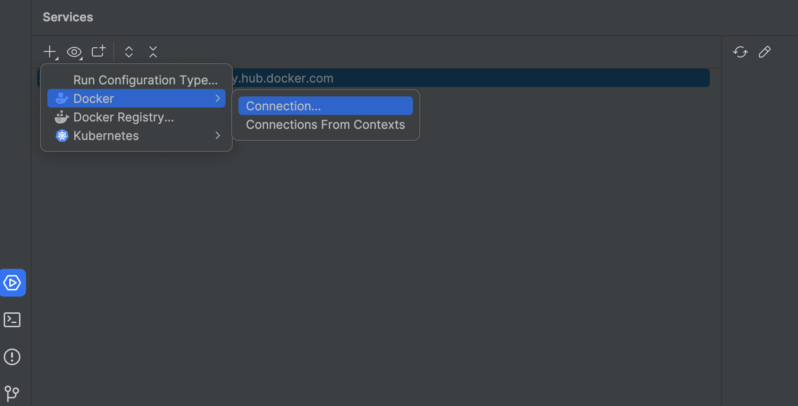
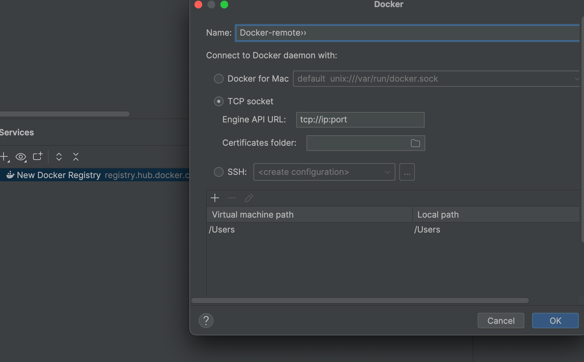

# 搭建docker环境

本地开发的时候需要搭建一个docker环境辅助测试，这里主要记录我遇到的几个问题。

我的需求是：
- 能够直接从docker hub拉取image镜像
- 本地机器内存不够，所以打算把docker跑在其他机器（旧笔记本电脑和台式机PC）

> ps: 处理过程中遇到的问题基本上就是文档没仔细读，以及对linux和systemd了解不够导致的。

## 1. 给 `dockerd` 配置 http proxy

https://docs.docker.com/engine/daemon/proxy/

> ps: 下面摘抄上面链接的文档，因为我使用的`systemd`允许的`dockerd`，所以只需要这部分。

Create a systemd drop-in directory for the docker service:

```
sudo mkdir -p /etc/systemd/system/docker.service.d
```
Create a file named `/etc/systemd/system/docker.service.d/http-proxy.conf` that adds the `HTTP_PROXY` environment variable:

```
[Service]
Environment="HTTP_PROXY=http://proxy.example.com:3128"
```

If you are behind an HTTPS proxy server, set the `HTTPS_PROXY` environment variable:

```
[Service]
Environment="HTTPS_PROXY=https://proxy.example.com:3129"
```

Multiple environment variables can be set; to set both a non-HTTPS and a HTTPs proxy;

```
[Service]
Environment="HTTP_PROXY=http://proxy.example.com:3128"
Environment="HTTPS_PROXY=https://proxy.example.com:3129"
```

## 2. 远程`dockerd`环境搭建

我需要在`本地开发机器`通过`docker`客户端操作运行在`其他闲置机器`的`dockerd`服务端。
1. 首先需要保证`dockerd`监听在`tcp`的某个端口上，而不只是`unix socket`
2. 其次需要在客户端操作`docker`的时候指定去操作运行在远程`tcp`的`dockerd`


### 2.1 搭建`dockerd`：https://docs.docker.com/engine/daemon/remote-access/

> ps: 摘抄上面的文档，同样由于我运行在`systemd`，所以只需要这部分。

Configuring remote access with systemd unit file
Use the command sudo systemctl edit docker.service to open an override file for docker.service in a text editor.

Add or modify the following lines, substituting your own values.


```
[Service]
ExecStart=
ExecStart=/usr/bin/dockerd -H fd:// -H tcp://127.0.0.1:2375
```
Save the file.

Reload the systemctl configuration.


```
sudo systemctl daemon-reload
```
Restart Docker.


```
sudo systemctl restart docker.service
```

Verify that the change has gone through.


```
sudo netstat -lntp | grep dockerd
tcp        0      0 127.0.0.1:2375          0.0.0.0:*               LISTEN      3758/dockerd
```

### 2.2 本地docker访问远程配置：

#### 2.2.1 设置环境变量

```shell
export DOCKER_HOST=tcp://localhost:2375
```

#### 2.2.2 使用`docker context` ： https://docs.docker.com/engine/manage-resources/contexts/

基本上这三个命令，效果和设置环境变量一样，好处上方便切换去连接多个不同的`dockerd`
```shell
docker context create docker-test --docker host=tcp://docker:2375
docker context use docker-test
docker context ls

```
#### 2.2.3 IDEA配置

找到IDEA的service部分，添加Docker

输入远程dockerd的连接信息
